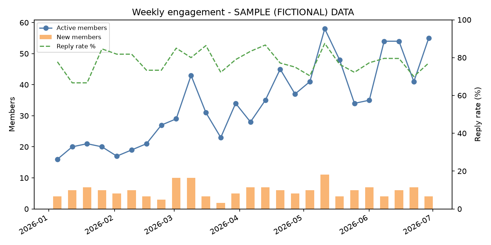

# Engagement report

> **Sample data only.** Generated fictional data; it does not describe any real community.

- Source: `data/engagement_sample.csv`
- Weeks covered: 26 (2026-01-05 to 2026-06-29)
- Total members at end: 212
- New members in period: 152

## Last 4 weeks (average per week)

- Active members: 51.0 (previous 4 weeks: 43.8)
- Active rate (%): 25.1 (previous 4 weeks: 24.3)
- Posts and replies per active member: 2.2 (previous 4 weeks: 2.0)
- Reply rate (%): 76.6 (previous 4 weeks: 78.4)
- Median hours to first reply: 5.0 (previous 4 weeks: 4.8)
- Moderation actions: 0.5 (previous 4 weeks: 1.0)

## Whole period

- Mean 4-week retention of new members (%): 33.3 (weeks with data: 22)
- Week with most joins: 2026-05-11 (11 new)
- Total moderation actions: 25

## Weekly detail

| week_start | new_members | active_members | active_rate_pct | reply_rate_pct | median_hours_to_first_reply |
|---|---|---|---|---|---|
| 2026-01-05 | 4 | 16 | 25.0 | 77.8 | 4.2 |
| 2026-01-12 | 6 | 20 | 28.6 | 66.7 | 4.6 |
| 2026-01-19 | 7 | 21 | 27.3 | 66.7 | 6.2 |
| 2026-01-26 | 6 | 20 | 24.1 | 84.6 | 1.8 |
| 2026-02-02 | 5 | 17 | 19.3 | 81.8 | 2.9 |
| 2026-02-09 | 6 | 19 | 20.2 | 81.8 | 5.7 |
| 2026-02-16 | 4 | 21 | 21.4 | 73.3 | 3.7 |
| 2026-02-23 | 3 | 27 | 26.7 | 73.3 | 5.2 |
| 2026-03-02 | 10 | 29 | 26.1 | 85.0 | 2.6 |
| 2026-03-09 | 10 | 43 | 35.5 | 80.0 | 7.4 |
| 2026-03-16 | 4 | 31 | 24.8 | 86.4 | 8.6 |
| 2026-03-23 | 2 | 23 | 18.1 | 72.2 | 5.8 |
| 2026-03-30 | 5 | 34 | 25.8 | 78.9 | 2.8 |
| 2026-04-06 | 7 | 28 | 20.1 | 83.3 | 4.5 |
| 2026-04-13 | 7 | 35 | 24.0 | 86.7 | 8.0 |
| 2026-04-20 | 6 | 45 | 29.6 | 77.1 | 3.2 |
| 2026-04-27 | 5 | 37 | 23.6 | 75.0 | 1.5 |
| 2026-05-04 | 6 | 41 | 25.2 | 70.4 | 7.9 |
| 2026-05-11 | 11 | 58 | 33.3 | 87.5 | 7.5 |
| 2026-05-18 | 4 | 48 | 27.0 | 76.5 | 2.9 |
| 2026-05-25 | 6 | 34 | 18.5 | 72.2 | 2.3 |
| 2026-06-01 | 7 | 35 | 18.3 | 77.3 | 6.3 |
| 2026-06-08 | 4 | 54 | 27.7 | 79.6 | 5.1 |
| 2026-06-15 | 6 | 54 | 26.9 | 79.5 | 6.7 |
| 2026-06-22 | 7 | 41 | 19.7 | 70.0 | 5.5 |
| 2026-06-29 | 4 | 55 | 25.9 | 77.1 | 2.8 |

## Caveats

- Weekly numbers are noisy; look at trends and compare with known events.
- "Active" is defined as any post, reply, or reaction; change the definition and the numbers change.
- Early weeks have no 4-week retention value yet.
