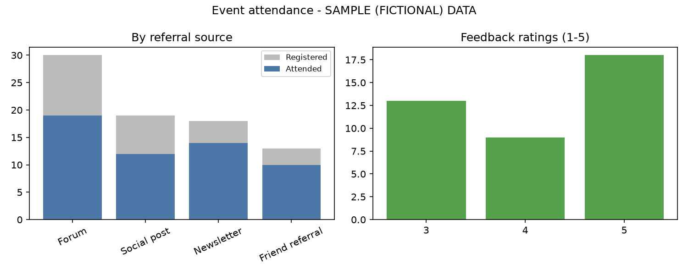

# Event attendance report

> **Sample data only.** Fictional registrations; not a real event.

- Source: `data/attendance_sample.csv`
- Registered: 80
- Attended: 55 (68.8%)
- No-shows: 25
- Stayed at least half the event (45+ min): 58.2% of attendees
- Feedback responses: 40 (72.7% of attendees)
- Mean feedback rating: 4.12

## Attendance by referral source

| referral_source | registered | attended | attendance_rate_pct |
|---|---|---|---|
| Forum | 30 | 19 | 63.3 |
| Social post | 19 | 12 | 63.2 |
| Newsletter | 18 | 14 | 77.8 |
| Friend referral | 13 | 10 | 76.9 |

## Attendance by level group

| level_group | registered | attended | attendance_rate_pct |
|---|---|---|---|
| Beginner | 35 | 26 | 74.3 |
| Intermediate | 24 | 19 | 79.2 |
| Advanced | 21 | 10 | 47.6 |

## New versus returning

| member_type | registered | attended | attendance_rate_pct |
|---|---|---|---|
| New | 59 | 40 | 67.8 |
| Returning | 21 | 15 | 71.4 |

## Caveats

- Feedback comes only from attendees who chose to respond, so it may not be representative.
- Small groups make percentages unstable.
